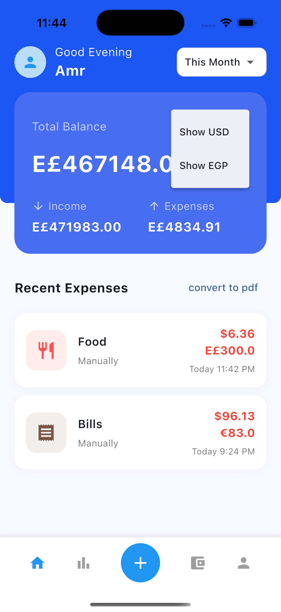
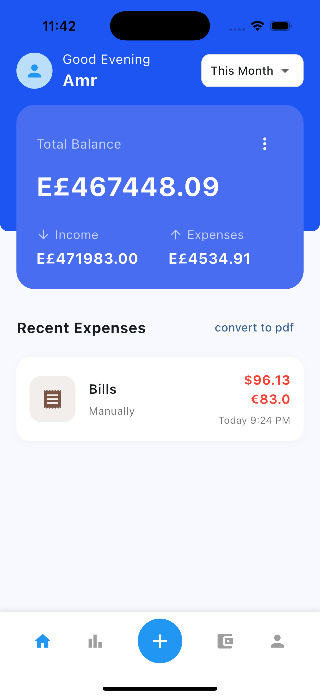
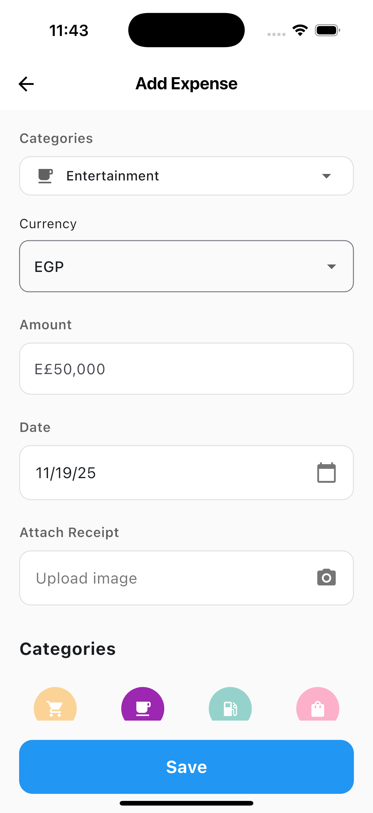
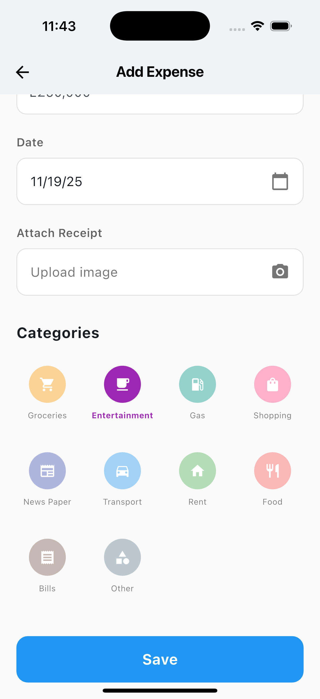
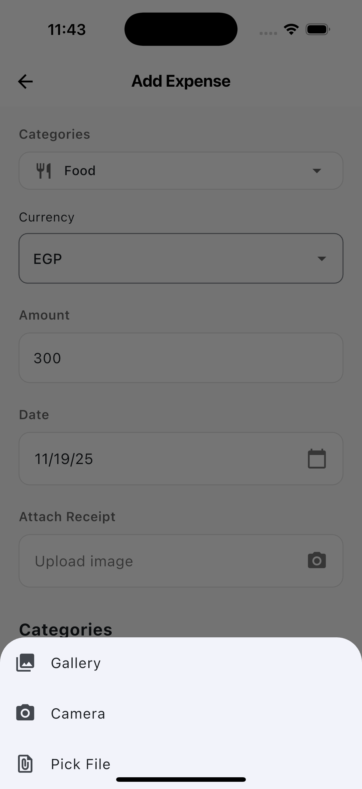

# Expense Tracker - Core Features Implementation

## ✅ All Core Features Implemented

### 1. Dashboard Screen ✅
- **User welcome message and profile image**: ✅ Implemented
  - Dynamic greeting based on time of day (Good Morning/Afternoon/Evening)
  - Profile avatar with user name "Shihab Rahman"
  
- **Displays**:
  - **Total balance**: ✅ Shows sum of all expenses in USD (from filtered expenses)
  - **Total income**: ✅ Displayed (currently $0.00, ready for future income tracking)
  - **Total expenses**: ✅ Shows total expenses in USD
  
- **Filter options**: ✅ Implemented
  - "This Month" - Shows expenses from current month
  - "Last 7 Days" - Shows expenses from last 7 days including today
  - "All" - Shows all expenses
  
- **List of recent expenses**: ✅ Implemented
  - Paginated list (10 items per page)
  - Shows category icon, name, amount, and date
  - Infinite scroll pagination
  - Pull-to-refresh support
  
- **Floating action button (FAB)**: ✅ Implemented
  - Located in bottom navigation bar (circular blue button with + icon)
  - Navigates to Add Expense screen

### 2. Add Expense Screen ✅
- **Fields**: ✅ All implemented
  - **Category**: Dropdown with category icons
  - **Amount**: Text input with number keyboard
  - **Date**: Date picker with calendar icon
  
- **Upload Receipt**: ✅ Implemented
  - Image picker integration
  - Gallery selection
  - Displays selected image path
  
- **Save button**: ✅ Implemented
  - Large blue button at bottom
  - Validates form before saving
  
- **Category icon selection UI**: ✅ Implemented
  - Grid layout with 4 columns
  - Circular icons with category names
  - Selected category highlighted in blue
  - "Add Category" option available
  
- **Currency selection dropdown**: ✅ Implemented
  - Supports: EGP, USD, EUR, SAR
  - Dropdown with currency codes

### 3. Currency Conversion (API Integration) ✅
- **Exchange rate fetching**: ✅ Implemented
  - Uses `exchangerate.host` API (free, no API key required)
  - Fetches latest rates with USD as base currency
  - Caches rates for performance
  
- **Currency conversion**: ✅ Implemented
  - Converts any currency to USD when saving expense
  - Handles conversion via base currency
  - Supports: EGP, USD, EUR, SAR and more
  
- **Store both amounts**: ✅ Implemented
  - Stores original amount in selected currency
  - Stores converted amount in USD (`convertedAmountUSD`)
  - Both displayed in expense list

### 4. Pagination ✅
- **10 items per page**: ✅ Implemented
  - `pageSize = 10` in ExpenseBloc
  
- **Infinite scroll**: ✅ Implemented
  - Automatically loads more when scrolling near bottom
  - Shows loading indicator while fetching
  - Prevents duplicate requests
  
- **Loading, empty, and error states**: ✅ All implemented
  - **Loading**: Circular progress indicator
  - **Empty**: Friendly message with icon and instructions
  - **Error**: Error icon, message, and retry button
  
- **Filters with pagination**: ✅ Implemented
  - Pagination respects current filter
  - Filter changes reset to page 0
  - Summary calculations use all filtered expenses (not just loaded page)

### 5. Local Storage ✅
- **Hive implementation**: ✅ Implemented
  - Uses Hive for local persistence
  - Expense model with Hive annotations
  - Automatic serialization/deserialization
  - Platform-specific storage (iOS/Android)
  - Data persists across app restarts

### 6. Expense Summary ✅
- **Total amount in base currency (USD)**: ✅ Implemented
  - Calculates from all filtered expenses (not just paginated list)
  - Shows in balance card on dashboard
  
- **Summarized by selected filter**: ✅ Implemented
  - Total balance updates when filter changes
  - Summary includes all expenses matching filter criteria
  - Income and Expenses breakdown displayed

## Technical Implementation Details

### Architecture
- **State Management**: BLoC pattern with flutter_bloc
- **Dependency Injection**: GetIt
- **Local Storage**: Hive
- **API Integration**: HTTP client with error handling
- **Date Formatting**: intl package

### Key Features
- ✅ Proper error handling throughout
- ✅ Loading states for async operations
- ✅ Form validation
- ✅ Date filtering with inclusive boundaries
- ✅ Currency conversion with caching
- ✅ Pagination with infinite scroll
- ✅ Pull-to-refresh support
- ✅ Responsive UI matching design

## Notes
- Income tracking is set up but currently shows $0.00 (ready for future implementation)
- All expenses are currently treated as expenses (no income/expense distinction yet)
- Currency conversion uses free API (exchangerate.host)
- Data persists locally using Hive


- **Feature-based modular structure**
- Each feature has its **own BLoC**
- UI reacts to state changes via `BlocBuilder` and `BlocListener`

---

## 🧩 State Management

- **BLoC Pattern** (`flutter_bloc`)
- Each module has a dedicated BLoC class:
  - `ExpenseBloc` → manages expense creation and listing
  - `DashboardBloc` → manages summary and filtering
- Provides predictable state transitions and testability

---

## 🌐 API Integration

- Uses [Open Exchange Rates API](https://open.er-api.com/v6/latest/USD) (or alternative)
- Converts expense amounts to USD at save time
- Handles offline scenarios by storing cached data
- Error handling for network issues included

---

## 📄 Pagination Strategy

- Local pagination using Hive
- 10 items per page
- Supports "Load More" or infinite scroll
- Filters applied alongside pagination

---

## 🎨 UI Screenshots

  
  
  
  
  

*Replace placeholders with actual screenshots from your app.*

---

## ⚖️ Trade-offs & Assumptions

- Offline mode supports storage but conversion requires internet
- Only three currencies supported (USD, EGP, EUR)
- Single-user app; no authentication
- PDF/CSV export not implemented yet
- Hive chosen over SQLite for simplicity

---

## 🏃 How to Run

1. Clone the repo:

```bash
git clone https://github.com/your-username/expense-tracker-lite.git
cd expense-tracker-lite

